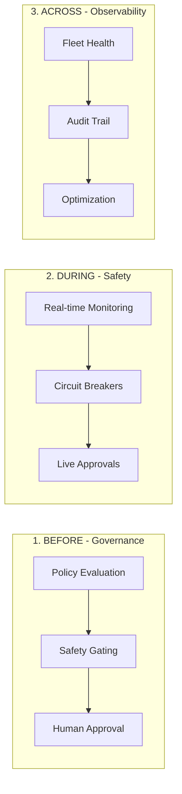

# Cordum - Agent Control Plane for Governance

**Source**: GitHub - cordum-io/cordum  
**Stars**: 678 | **Forks**: 62 | **License**: BUSL-1.1  
**Primary Language**: Go  
**Protocol**: CAP (Cordum Agent Protocol)  
**Published**: 2025-2026

---

## Overview

**Know What Your AI Agents Are Doing. Before They Do It.**

The Source-Available **Agent Control Plane** for Governance, Safety, and Trust.

> "Enterprises are rushing to deploy **Autonomous AI Agents**, but they're hitting a wall of risk."

Cordum provides a deterministic governance layer for probabilistic AI minds. It allows you to define, enforce, and audit the behavior of your **Autonomous AI Agents** across any framework or model.

---

## The Problem: The Agent Risk Gap

According to Gartner, **74% of enterprises see AI agents as a new attack vector**, and over 40% of agentic AI projects will be canceled due to inadequate risk controls.

Without a dedicated governance layer:
- **No visibility**: You don't know what your agents are doing until *after* they do it
- **No safety rails**: No way to intercept dangerous operations before execution
- **No human-in-the-loop**: Sensitive actions happen without manual oversight
- **No audit trail**: Can't reconstruct the chain of thought

---

## Key Features

| Feature | Description |
|---------|-------------|
| **Safety Gating** | Block destructive actions *before* they occur |
| **Output Quarantine** | Automatically block PII leaks, secrets, hallucinations |
| **Human-in-the-Loop** | Mandate human oversight for high-risk operations |
| **Pool Segmentation** | Ensure sensitive data reaches only trusted agents |
| **Deterministic Audit** | Full chain-of-thought audit trail |
| **Governance Policies** | Declarative YAML-based rules |
| **Policy Simulator** | Test rules against historical data before rollout |

---

## Governance Across the Lifecycle



- **BEFORE (Governance)**: Define declarative policies that evaluate job requests *before* an agent executes
- **DURING (Safety)**: Real-time visibility into active agent runs, handle step-level approvals
- **ACROSS (Observability)**: Manage entire fleet from single control plane

---

## Architecture

```
cordum/
├── cmd/                          # Service entrypoints + CLI
│   ├── cordum-api-gateway/       # API gateway (HTTP/WS + gRPC)
│   ├── cordum-scheduler/         # Scheduler + safety gating
│   ├── cordum-safety-kernel/     # Policy evaluation
│   ├── cordum-workflow-engine/   # Workflow orchestration
│   ├── cordum-context-engine/    # Optional context/memory service
│   └── cordumctl/                # CLI
├── core/                         # Core libraries
│   ├── controlplane/             # Gateway, scheduler, safety kernel
│   ├── context/                  # Context engine implementation
│   ├── infra/                    # Config, storage, bus, metrics
│   ├── protocol/                 # API protos + CAP aliases
│   └── workflow/                 # Workflow engine
├── dashboard/                    # React UI
├── sdk/                          # SDK + worker runtime
├── cordum-helm/                  # Helm chart
├── deploy/k8s/                   # Kubernetes manifests
└── docs/                         # Documentation
```

---

## Protocol: CAP - Open Standard for Agent Governance

Cordum implements **CAP (Cordum Agent Protocol)**, an open protocol for distributed AI agent governance.

### CAP vs. MCP

| Protocol | Focus | Level | Responsibility |
|----------|-------|-------|----------------|
| **MCP** (Model Context Protocol) | Tool Calling | Local | How a model interacts with a tool |
| **CAP** (Cordum Agent Protocol) | Governance | Network | How an agent is governed within an enterprise |

- **MCP** is for *within* the agent
- **CAP** is for *above* the agent

---

## Quick Start

```bash
git clone https://github.com/cordum-io/cordum.git
cd cordum
./tools/scripts/quickstart.sh
```

**Dashboard**: http://localhost:8082  
**Login**: `admin` / `admin123`

### Docker Compose

```bash
docker compose up -d
```

### Kubernetes

```bash
helm install cordum oci://ghcr.io/cordum-io/cordum/charts/cordum \
  --namespace cordum --create-namespace \
  --set secrets.apiKey=$(openssl rand -hex 32) \
  --set redis.auth.password=$(openssl rand -hex 32) \
  --set ingress.enabled=true
```

---

## Ports

| Port | Service |
|------|---------|
| 8082 | Dashboard |
| 8081 | API Gateway (HTTPS) |
| 9080 | gRPC Gateway |
| 4222 | NATS |
| 6379 | Redis |
| 9092 | Gateway Metrics |
| 9093 | Workflow Engine Health |
| 50051 | Safety Kernel (gRPC) |
| 50400 | Context Engine (gRPC) |

---

## SDK

```go
import (
    "log"
    "github.com/cordum/cordum/sdk/runtime"
)

type Input struct {
    Prompt string `json:"prompt"`
}

type Output struct {
    Summary string `json:"summary"`
}

func main() {
    agent := &runtime.Agent{Retries: 2}

    runtime.Register(agent, "job.summarize", func(ctx runtime.Context, input Input) (Output, error) {
        return Output{Summary: input.Prompt}, nil
    })

    if err := agent.Start(); err != nil {
        log.Fatal(err)
    }
    select {}
}
```

**SDKs**: Go (stable) | Python | Node

---

## Integration Packs

30+ integration packs for Slack, GitHub, AWS, Jira, Terraform, Datadog, PagerDuty, and more.

| Pack | Category |
|------|----------|
| Slack | Communication |
| GitHub | DevOps |
| AWS | Cloud |
| Kubernetes | DevOps |
| Terraform | DevOps |
| Datadog | Monitoring |
| LangChain | AI Framework |
| MCP Bridge | AI Framework |

---

## Enterprise Features

- SSO/SAML integration
- Advanced RBAC
- SIEM export
- Priority support

---

## Comparison

| Feature | Cordum | Guardrails AI | NeMo Guardrails | Custom Middleware |
|---------|--------|---------------|-----------------|-------------------|
| Pre-execution policy engine | ✅ Safety Kernel | ❌ | ⚠️ | ⚠️ |
| Human-in-the-loop approvals | ✅ | ❌ | ❌ | ⚠️ |
| Multi-agent fleet governance | ✅ | ❌ | ❌ | ❌ |
| Deterministic audit trail | ✅ | ❌ | ❌ | ⚠️ |
| Framework agnostic | ✅ Any via CAP | ❌ | ❌ | ❌ |
| MCP governance | ✅ Bridge + Gateway | ❌ | ❌ | ❌ |

---

## Cross-References

**Related**: [[AEGIS]], [[GoClaw]] (agent control plane), [[FerrumDeck]]  
**Similar Systems**: [[Cordum Enterprise]], [[AgentGuard]]
