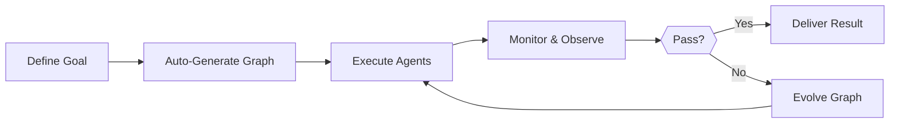

# Hive - Multi-Agent Harness for Production

**Source**: GitHub - aden-hive/hive  
**Stars**: 10,006 | **Forks**: 892 | **License**: Apache 2.0  
**Primary Language**: Python  
**Published**: 2025-2026

---

## Overview

**The agent harness for production workloads** — state management, failure recovery, observability, and human oversight so your agents actually run.

Hive is the multi-agent harness layer for teams moving AI agents from prototype to production. Single agents like Openclaw and Cowork can finish personal jobs pretty well but lack the rigor to fulfil business processes.

---

## Who Is Hive For?

Hive is a good fit if you:

- Want AI agents that **execute real business processes**, not demos
- Need a **runtime that handles state, recovery, and parallel execution** at scale
- Need **self-healing and adaptive agents** that improve over time
- Require **human-in-the-loop control**, observability, and cost limits
- Plan to run agents in **production** where uptime, cost, and auditability matter

---

## Quick Links

- **[Documentation](https://docs.adenhq.com/)** - Complete guides and API reference
- **[Self-Hosting Guide](https://docs.adenhq.com/getting-started/quickstart)** - Deploy Hive on your infrastructure
- **[Changelog](https://github.com/aden-hive/hive/releases)** - Latest updates and releases
- **[Roadmap](docs/roadmap.md)** - Upcoming features and plans

---

## Quick Start

### Prerequisites

- Python 3.11+ for agent development
- An LLM provider that powers the agents
- **ripgrep** (optional, recommended on Windows)

### Installation

```bash
# Clone the repository
git clone https://github.com/aden-hive/hive.git
cd hive

# Run quickstart setup (macOS/Linux)
./quickstart.sh

# Windows (PowerShell)
.\quickstart.ps1
```

This sets up:
- **framework** - Core agent runtime and graph executor
- **aden_tools** - MCP tools for agent capabilities
- **credential store** - Encrypted API key storage (`~/.hive/credentials`)
- **LLM provider** - Interactive default model configuration

---

## Features

| Feature | Description |
|---------|-------------|
| **Multi-Agent Coordination** | Parallel task execution across agents |
| **Graph-based Execution** | DAG for recurring and complex processes |
| **Role-based Memory** | Evolves with your projects |
| **Zero Setup** | No technical configuration required |
| **General Compute** | Browser and command execution |
| **Custom Model Support** | Any LLM provider via LiteLLM |

---

## Architecture

```
┌──────────────────────────────────────────────────────────────────┐
│                    Hive Runtime Layer                            │
├──────────────────────────────────────────────────────────────────┤
│  ┌── Multi-Agent ──────────────────────────────────────────┐    │
│  │  Queen Agent ──► Worker Agents ──► Task Execution       │    │
│  └─────────────────────────────────────────────────────────┘    │
│                                                                  │
│  ┌── State Management ─────────────────────────────────────┐    │
│  │  Checkpoint-based crash recovery ──► Session Isolation   │    │
│  └─────────────────────────────────────────────────────────┘    │
│                                                                  │
│  ┌── Observability ────────────────────────────────────────┐    │
│  │  Real-time metrics ──► Budget enforcement ──► Audit logs │    │
│  └─────────────────────────────────────────────────────────┘    │
└──────────────────────────────────────────────────────────────────┘
```

---

## How It Works



1. **Define Your Goal** → Describe what you want to achieve in plain English
2. **Coding Agent Generates** → Creates the agent graph, connection code, test cases
3. **Workers Execute** → SDK-wrapped nodes run with full observability
4. **Control Plane Monitors** → Real-time metrics, budget enforcement, policy management
5. **Adaptiveness** → On failure, the system evolves the graph and redeploys automatically

---

## Multi-Agent Topologies

Hive dynamically generates multi-agent topologies based on your objective:

- **Sequential chains** → Linear task execution
- **Parallel branches** → Concurrent task execution
- **Conditional routing** → Branch based on results
- **Feedback loops** → Adaptive refinement

---

## Integration

### LLM Flexibility

Hive supports 100+ LLM providers through LiteLLM integration:
- OpenAI (GPT-4, GPT-4o)
- Anthropic (Claude models)
- Google Gemini
- DeepSeek
- Mistral
- Groq
- OpenRouter
- Hive LLM
- Local models via Ollama

### Business System Connectivity

Connect to business systems as tools via MCP:
- CRM (Salesforce, HubSpot)
- Support (Zendesk, ServiceNow)
- Messaging (Slack, Teams, Discord)
- Data (Snowflake, BigQuery, PostgreSQL)
- File (S3, Google Cloud Storage)

---

## Why Hive?

As models improve, the upper bound of what agents can do rises — but their reliability and production value are determined by the harness.

| Capability | Without Hive | With Hive |
|------------|--------------|-----------|
| State persistence | Lost across sessions | Survives context compression |
| Failure recovery | Silent failures | Automatic recovery and retry |
| Parallel execution | Manual coordination | Auto-generated topologies |
| Observability | None | Full visibility and metrics |
| Human oversight | Manual | Built-in approval gates |
| Cost control | None | Budget enforcement per agent |

---

## Documentation

| Document | Description |
|----------|-------------|
| **[Developer Guide](docs/developer-guide.md)** | Comprehensive guide for developers |
| [Getting Started](docs/getting-started.md) | Quick setup instructions |
| [Configuration Guide](docs/configuration.md) | All configuration options |
| [Architecture Overview](docs/architecture/README.md) | System design and structure |

---

## Contributing

We welcome contributions! See [CONTRIBUTING.md](CONTRIBUTING.md) for guidelines.

1. Find or create an issue and get assigned
2. Fork the repository
3. Create your feature branch
4. Commit your changes
5. Push to the branch
6. Open a Pull Request

---

## Community & Support

- **Discord**: [Join our community](https://discord.com/invite/MXE49hrKDk)
- **Twitter/X**: [@adenhq](https://x.com/aden_hq)
- **LinkedIn**: [Company Page](https://www.linkedin.com/company/teamaden/)

---

## License

Apache License 2.0 - see [LICENSE](LICENSE) file for details.

---

## Cross-References

**Related**: [[DeerFlow]], [[Chorus]], [[Citadel]]  
**Similar Systems**: [[AutoGen]], [[CrewAI]], [[LangGraph]]
