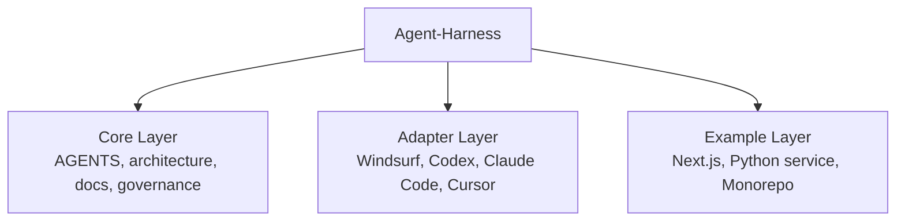

# Agent-Harness

[](https://github.com/zuoyui/Agent-Harness/actions/workflows/ci.yml)
[](https://opensource.org/licenses/MIT)
[](https://github.com/zuoyui/Agent-Harness/generate)

**Turn any repository into an agent-readable, governed, feedback-looped workspace.**

*An agent-agnostic harness engineering framework for AI coding agents.*

> Most AI coding agents fail not because the model is weak, but because the repository is unreadable, under-specified, and missing executable constraints. Agent-Harness fixes this.

## Framework Overview



## Quickstart

### Option 1 — Use as template

[**→ Use this repository as a template**](https://github.com/zuoyui/Agent-Harness/generate)

### Option 2 — Add to an existing project

```bash
cp -r core/ your-project/
cp -r adapters/codex/.codex your-project/
cp -r core/governance/* your-project/.github/
```

## Supported Agents

| Agent | Status |
|-------|--------|
| [Windsurf](adapters/windsurf/) | ✅ Full implementation |
| [Codex](adapters/codex/) | ✅ Full implementation |
| [Claude Code](adapters/claude-code/) | ✅ Full implementation |
| [Cursor](adapters/cursor/) | 📖 Guide available |
| [Other agents](adapters/generic/) | 📖 Generic guide |

## Examples

| Example | Scenario |
|---------|----------|
| [Next.js App](examples/nextjs-app/) | Frontend/full-stack with Tailwind and TypeScript |
| [Python Service](examples/python-service/) | Backend service with security constraints |
| [Monorepo](examples/monorepo/) | Multi-package project with nested AGENTS.md |

## Why it matters

| Without Harness | With Harness |
|-----------------|--------------|
| Prompt is a long string | Entry docs + progressive disclosure |
| Agent frequently gets lost | Fixed navigation paths |
| Specs scattered in Slack | Repository as system of record |
| Rules depend on human reminders | Rules / hooks / CI enforcement |
| Tool lock-in | Agent-agnostic adapters |

**What you get:**
- Move critical knowledge into the repository
- Replace prompt-only discipline with repo-native structure
- Enforce boundaries through governance
- Bootstrap agent-first development across different tools

## How It Works

1. **Agent reads `AGENTS.md`** — Knows where to start, what commands to use
2. **Agent follows `ARCHITECTURE.md`** — Knows where code belongs, dependency direction
3. **Agent references `docs/`** — Finds design decisions, exec plans, quality standards
4. **Agent respects rules/hooks** — Avoids dangerous commands, validates changes
5. **Agent uses PR templates** — Produces consistent, traceable changes

## Repository Structure

```
Agent-Harness/
├── core/                    # Core layer (tool-agnostic)
│   ├── AGENTS.md            # Entry navigation
│   ├── ARCHITECTURE.md      # Layer boundaries
│   ├── docs/                # Knowledge system
│   ├── governance/          # GitHub governance
│   └── scripts/             # Automation scripts
├── adapters/                # Adapter layer (tool-specific)
│   ├── windsurf/            # Windsurf IDE
│   ├── codex/               # OpenAI Codex
│   ├── claude-code/         # Claude Code
│   ├── cursor/              # Cursor IDE
│   └── generic/             # Generic guide
├── examples/                # Example implementations
│   ├── nextjs-app/          # Next.js frontend
│   ├── python-service/      # Python backend
│   └── monorepo/            # Monorepo project
├── docs/                    # Generated docs & references
├── README.md
├── LICENSE
├── CHANGELOG.md
└── ROADMAP.md
```

## FAQ

### Is this only for Windsurf?

No. Agent-Harness is agent-agnostic. Windsurf is just one adapter. The `core/` layer works with any agent that reads markdown files.

### What if my agent doesn't support AGENTS.md?

Use the adapter pattern. Create a mapping from `core/` to your agent's configuration. See `adapters/generic/` for guidance.

### Can I use this in an existing project?

Yes. Copy `core/` and your chosen adapter. Update commands and architecture to match your project.

### How is this different from just writing good docs?

Agent-Harness provides:
- **Structure**: Not just docs, but a navigable system
- **Constraints**: Rules and hooks that enforce behavior
- **Feedback loops**: CI, hooks, and governance
- **Adapters**: Ready-to-use configs for multiple agents

## Contributing

See `core/governance/CONTRIBUTING.md` for guidelines.

### Adding a New Adapter

1. Create `adapters/your-agent/`
2. Include config files and README
3. Submit a PR

### Adding a New Example

1. Create `examples/your-project-type/`
2. Include AGENTS.md, ARCHITECTURE.md, README
3. Submit a PR

## Roadmap

See [ROADMAP.md](ROADMAP.md) for planned features and releases.

## References

- [OpenAI: Harness Engineering](https://openai.com/index/harness-engineering/)
- [Windsurf Docs: AGENTS.md](https://docs.windsurf.com/windsurf/cascade/agents-md)
- [Anthropic: Claude Code](https://docs.anthropic.com/claude-code)
- [GitHub Docs: Managing Pull Requests](https://docs.github.com/en/pull-requests/collaborating-with-pull-requests/getting-started/managing-and-standardizing-pull-requests)

## License

[MIT](LICENSE)

